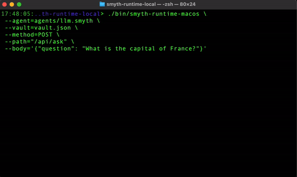

<p align="center">
  
</p>

# Smyth Runtime Local

Smyth Runtime Local is a local version of the Smyth Runtime. You can use the executable to run, test and develop Smyth agents locally.

### Getting Started
To get started, clone the repository, copy the vault template and add your API keys to the vault.json file. The use the binary for your platform to run the agent.
```
git clone git@github.com:Smyth-ai/smyth-runtime-local.git
cp vault.json.example vault.json          # add API keys to vault.json

./bin/smyth-runtime-macos \


/Users/anthonybudd/Development/SmythOS/smyth-runtime/distributions/cli/dist/smyth-runtime-macos \
 --agent=/Users/anthonybudd/Development/SmythOS/smyth-runtime-local/agents/llm.smyth \
 --vault=/Users/anthonybudd/Development/SmythOS/smyth-runtime-local/vault.json \
 --vault-key=/Users/anthonybudd/Development/SmythOS/smyth-runtime-local/smyth.pem \
 --method=POST \
 --path="/api/ask" \
 --body='{"question": "What is the capital of France?"}'
```

<p align="center">
  
</p>


### CLI Arguments
| Argument         | Description                     |
|------------------|---------------------------------|
| `--agent`        | Path to `.smyth` agent file     |  
| `--vault`        | Path to the vault file          |
| `--vault-key`    | Path to the pem file to decrypt `--vault`  |
| `--method`       | The HTTP method to use          | 
| `--path`         | Path to the API Endpoint        | 
| `--query`        | Query parameters as JSON        | 
| `--body`         | Body parameters as JSON         | 
| `-v`             | Display version information     | 
| `-d`             | Dump all args to the console    | 
| `--help, -h`     | Show help message               | 
